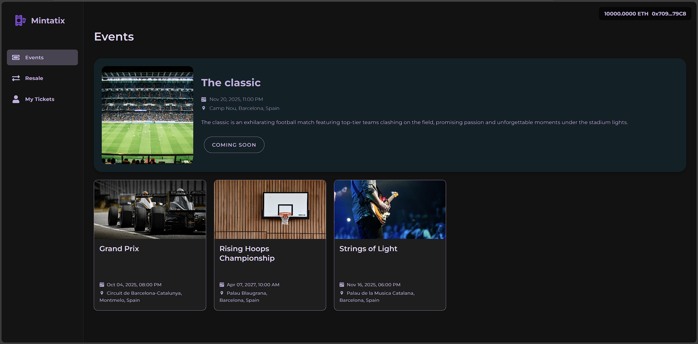

#  Mintatix · NFT Ticketing DApp


**Mintatix** is a full-stack Web 3 solution that turns event tickets into non-fungible tokens (NFTs) on Ethereum.
It pairs a gas-optimised, upgradeable Solidity smart-contract (ERC-721A) with a React + Wagmi front-end so organisers can mint, sell and validate tickets while protecting fans from scams, fraud and price gouging.
You can try the final version deployed on Sepolia Network at: https://mintatix.ddns.net

---

## Table of Contents

* [Features](#features)
* [Tech Stack](#tech-stack)
* [Installation & Setup](#installation--setup)
    * [Smart-Contract (Hardhat)](#smart-contract-hardhat)
    * [dApp (React + Wagmi)](#dapp-react--wagmi)
* [Usage](#usage)
* [Screenshots & GIFs](#screenshots--gifs)
* [Author](#author)

---

## Features

| Category              | Highlight                                                                                           |
| --------------------- | ----------------------------------------------------------------------------------------------------|
| **Primary flow**      | • Mint primary-stock tickets (one or many per adress) </br>• Secondary market with fixed-limit price resale |
| **Limit per address** | Each wallet can hold up to `maxTicketsPerAddress` tickets |
| **Price control**     | Resellers cannot list above **+30 %** of original face value, stopping predatory mark-ups           |
| **Fraud defence**     | State machine (`Active` → `Pending` → `Redeemed`) blocks sales of already-used tickets    |
| **Time windows**      |  Event start/finish limits disable trading or redemption after the show ends                |
| **Secure redemption** | Commit-reveal scheme + QR code lets gate staff validate tickets            |
| **Gas efficiency**    | Uses **ERC-721A Upgradeable** and custom errors to keep byte-code size & gas low                    |
| **Chain agnostic**    | easily switch RPC for Mainnet, Gnosis, etc.                            |

---

## Tech Stack
* **Smart contract**: Solidity 0.8.x, Hardhat, OpenZeppelin upgradeable libs, ERC-721A&#x20;
* **Front-end**: React 18, TypeScript, Wagmi + Viem for wallet/contract I/O, React Router, QRCode.react&#x20;

---

## Installation & Setup

> **Prerequisites**
>
> * Node ≥ 18 & npm (or pnpm/Yarn) https://nodejs.org/en/download
> * A MetaMask wallet with at least one of the Hardhat tests adresses:<br><br>
> > Account #0: 0xf39Fd6e51aad88F6F4ce6aB8827279cffFb92266 <br>
    Private Key: 0xac0974bec39a17e36ba4a6b4d238ff944bacb478cbed5efcae784d7bf4f2ff80<br><br>
> Account #1: 0x70997970C51812dc3A010C7d01b50e0d17dc79C8 <br>
    Private Key: 0x59c6995e998f97a5a0044966f0945389dc9e86dae88c7a8412f4603b6b78690d<br><br>
> Account #2: 0x3C44CdDdB6a900fa2b585dd299e03d12FA4293BC <br>
Private Key: 0x5de4111afa1a4b94908f83103eb1f1706367c2e68ca870fc3fb9a804cdab365a


### Smart-Contract (Hardhat)

```bash
git clone https://github.com/lucas12avl/Mintatix.git
cd Mintatix
npm install
npx hardhat node    # starts the Hardhat Network
npx hardhat test    # run unit tests (optional)
```
In another terminal inside mintatix directory:
```bash
cd ./modules
npx hardhat ignition deploy ./Mintatix.js --network localhost # this file will deploy the smart contracts on your Hardhat Network
```

### dApp (React + Wagmi)
In another terminal inside mintatix directory:
```bash
cd frontend
npm install
npm run dev # starts Vite dev server on http://localhost:5173
```

---

## Usage

1. **Connect Wallet** – Open the DApp, connect MetaMask and switch to the network requested by the *ChainSwitcher* popup.&#x20;
2. **Buy Primary Tickets** – Visit *Events* page, pick a show and click **Mint**. Hardhat network or Sepolia will prompt for gas.
3. **Resell** – Go to *My Tickets*, choose a ticket in `Active` state, set a price ≤ 130 % face value, and list.&#x20;
4. **Redeem at Venue** – In `Pending` state press **Redeem** to generate a one-time QR; gate staff scan within 10 min to finalise.&#x20;
5. **Admin tasks** – Organiser wallet can add validators, withdraw funds, or update base URI.

---

## Screenshots & GIFs
### Home Page

### Stock Purchase

### Redeem Ticket

### Resale Ticket

### Resale Shop


---

## Author

**Lucas Dalmau**
